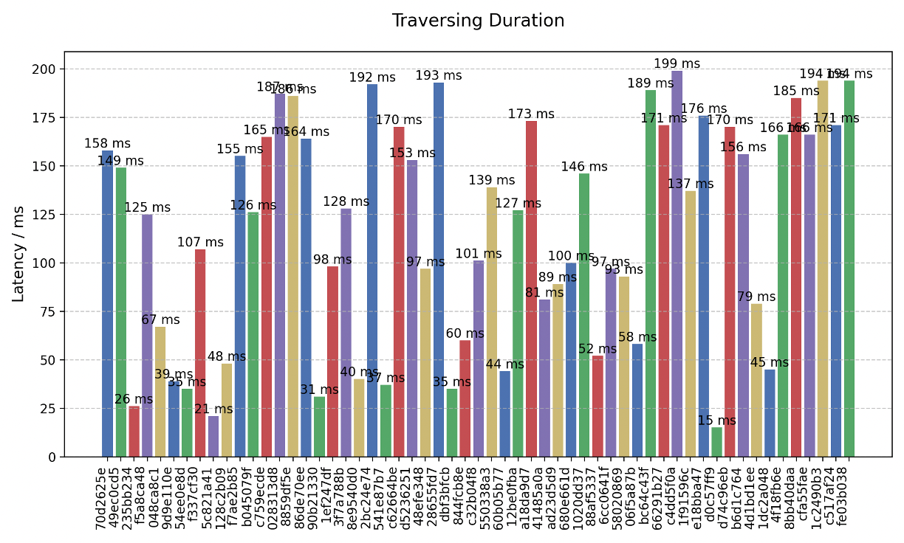
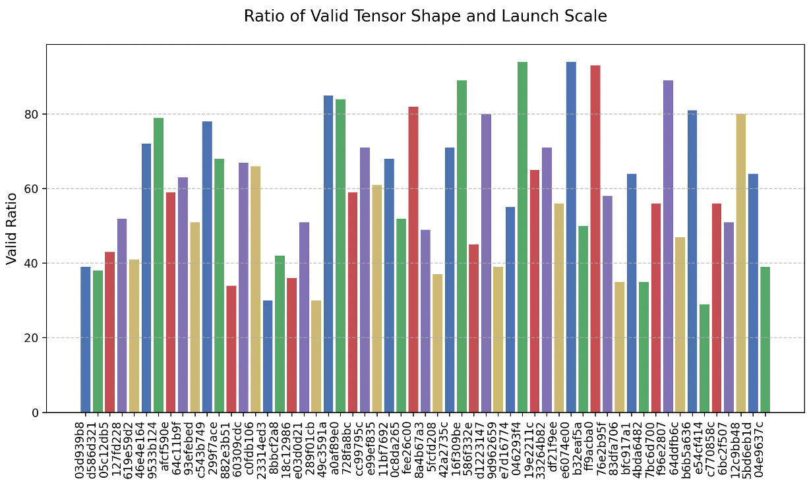

## Gtest: Course Project for CS6215

### How to build and Run

1. developper can use the scripts under `scripts/docker/run_cuda_12_8.sh` to run the docker environment for testing GPU kernel from SASS (nVIDIA binary level).

```bash
cd scripts/docker
bash run_cuda_12_8.sh -s 1 # start the container with id 1
bash run_cuda_12_8.sh -e 1 # start the container with id 1
bash run_cuda_12_8.sh -c 1 # close the container with id 1
```

2. after entering the container, one can directly run the gtest package by the following command to testing specifed CUDA source file which contains GPU kenrle definitions.

```bash
python3 -m gtest.toolbox.binary_utilities.cuda.parse_sass
```

### Tesing Result

The evaluation result below demonstrate the average mutation scores during the fuzzing process of the examle CUDA sources.





